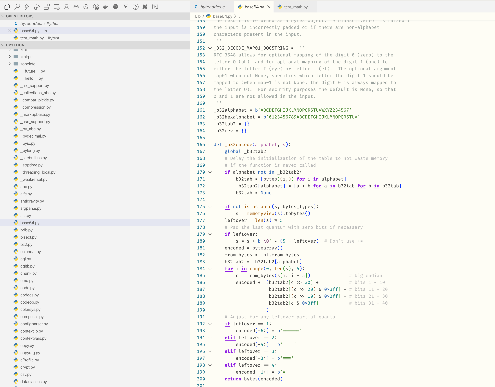
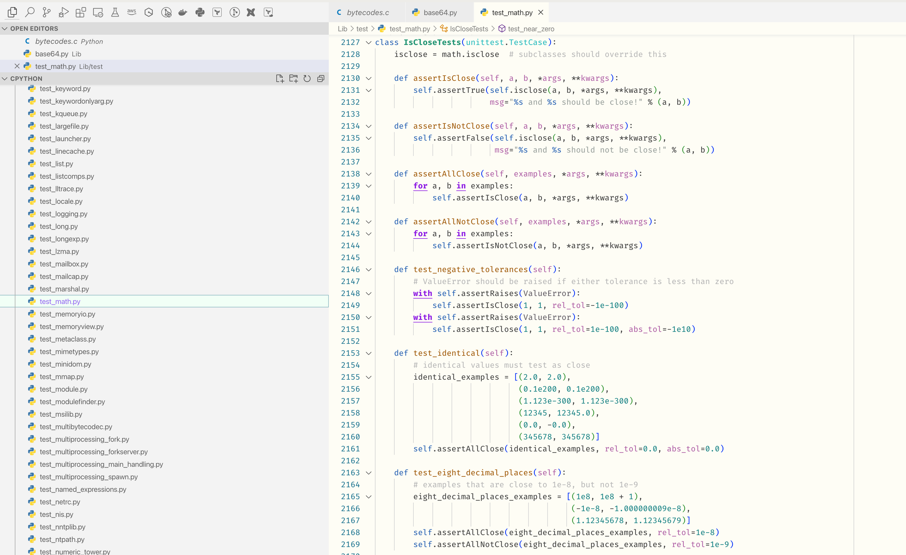

# Lumen theme

Python centric light color theme for VS Code.

## Installation

1. Open the extensions sidebar on Visual Studio Code
2. Search for **Lumen Theme**
3. Click **Install** to install it.
4. Click **Reload** to reload your editor.
5. Code/File ＞ Preferences ＞ Color Theme ＞ **Lumen Theme**.

## License

[BSD 3-Clause](https://github.com/pavel-slepenkov/vs-code-lumen-theme/blob/main/LICENSE.txt)